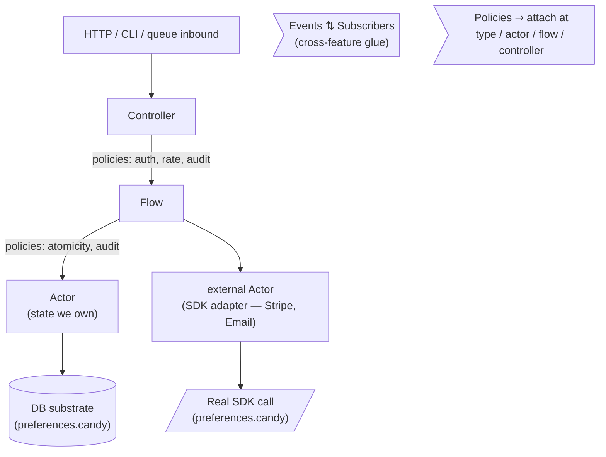

# Architecture

candy systems have a fixed layering. Each layer owns specific concerns;
dependencies point one direction; policies cross-cut as needed.

## The layers

An inbound request enters at the top, descends through layers, may invoke
external services, and returns:



## Dependency direction

Always one-way:

- `controller` references `flow` by name.
- `flow` references `actor` and `external actor` by name.
- `actor` references `type`; may `subscribe` to events.
- `type` references nothing.

The reverse arrows do not exist. **An actor never knows which flow called
it; a flow never knows which controller called it.** This is hexagonal
architecture: the core (actor) is independent of adapters (controller).

The implication: a single flow can be exposed by multiple adapters — HTTP
today, CLI tomorrow, queue consumer the day after. The flow doesn't change.

## Policies — four attachment points

A policy is a rule cluster (prose + examples). Policies attach to the
*scope* they govern via a `policies:` field. Four valid scopes:

### Type-level

```candy
type Password string {
  intent: "plaintext at rest is forbidden"
  policies: [PasswordStrength]
}
```

Strongest. Every value of this type satisfies the policy at construction.
Codegen enforces at every constructor; no backdoor.

### Actor-level

```candy
actor User(id: Id) {
  policies: [AuditLog]
  ...
}
```

Every `accepts` on this actor is wrapped by the policy. Useful for audit,
rate limit per actor, pre/post hooks.

### Flow-level

```candy
flow PlaceBooking(...) -> ... {
  policies: [TransactionalAtomicity, RateLimit]
  ...
}
```

The whole saga is governed. Useful for cross-actor invariants (atomicity,
saga-boundary idempotency, rate limiting).

### Controller-level

```candy
controller Bookings {
  policies: [BearerAuth]
  POST /bookings -> PlaceBooking(...) {
    policies: [AntiSpam]
    ...
  }
}
```

The controller block declares policies that apply to all routes; each
route can declare additional policies just for that route.

### Why explicit attachment

Policies were floating before — any flow could ignore them silently.
Explicit attachment means **you can grep for the policy and see every
place it is enforced**. The dependency graph is visible from the source.

## Substrate vs. spec

Two kinds of "thing we don't own":

**Substrate** — Postgres, Redis, BullMQ, S3. Universal infrastructure for
persistence, queueing, caching, storage. **Lives in `preferences.candy`,
never in `spec/`.** An actor with `state {}` is implicitly persisted; we
don't write `ask Postgres.Insert(...)`. Codegen wires the substrate per
target.

**External services with explicit messages** — Stripe, SendGrid, OpenAI,
Twilio. SDKs we send specific commands to and get specific responses
from. **First class in the spec as `external actor` blocks.** See
[externals.md](externals.md).

The dividing line: if you'd be inventing a contract anyway (`createPaymentIntent`,
`sendEmail`), it's an external actor. If it's universal infrastructure
with idiomatic per-language libraries, it's substrate.

## Events — cross-cutting glue

Events flow horizontally across the layers:

- An `actor` emits `OrderPlaced` from inside a `commit`.
- An `external actor Stripe` emits `ChargeSucceeded` (a webhook).
- Any `actor` can `subscribe` to either.
- A `flow` can emit events from its commit.

Subscribers don't know who emitted; emitters don't know who subscribes.
That decoupling is the point. The event dependency graph is recoverable
mechanically from `emit` and `subscribe` declarations.

## Reading order

Two views of the same project, both legitimate:

**For humans (top-down, intent-first):**

```
candy.toml → preferences.candy
  → spec/types.candy, events.candy, invariants.candy, externals.candy
    → for each feature/:
        prose.candy        ← read first; intent, exports, uses
        types.candy        ← feature-local types
        actors.candy
        policies.candy
        flows.candy
        events.candy
        controllers.candy  ← entry points; read last
  → conformance/
```

**For dependency resolution (bottom-up):**

```
types → events → externals → actors → policies → flows → controllers
```

Files on disk follow dependency order so a parser resolves forward
references easily. `prose.candy` is the human entry point per feature —
like a README per slice.

## Designing a new feature

The order matters. Intent first, implementation last:

1. Write `prose.candy` intent. What + why. One paragraph.
2. List external dependencies in `uses:`. Forces the dependency story upfront.
3. Decide the public API in `exports:`.
4. Sketch types this feature owns.
5. Sketch actors (state + messages).
6. Identify policies; attach them.
7. Compose flows (the cross-actor sagas).
8. Map controllers (HTTP surface, error mapping).
9. Declare events for cross-cutting fan-out.
10. Write conformance covering the exported flows end-to-end.

Top-down. The implementation falls out of the prose, not the other way
around.
